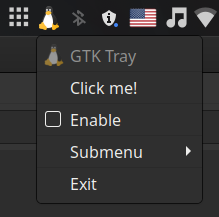

# tray-gtk

Build GTK tray icons in Kotlin with ease.</br>

### Usage

To use this library, add jitpack to your project's repositories:

```kotlin
maven { url = URI("https://jitpack.io") }
```

And then add the following dependency to your build.gradle.kts file:

```kotlin
implementation("com.github.hristogochev:tray-gtk:0.1.0")
```

Or if you want to use the most up to date commit version:

```kotlin
implementation("com.github.hristogochev:tray-gtk:master-SNAPSHOT")
```

### Notes

* Only works with GTK-3 and will not work with GTK-2.
* An internal reference to all created tray icons is kept at all times in order to avoid garbage collection of GTK structs.


### Example



```kotlin
trayIcon(
    imagePath = "/path/to/tray/icon/image",
    visible = true,
    title = "GTK Tray Icon",
    tooltip = "GTK Tray Icon"
) {
    menu {
        item(
            text = "GTK Tray",
            enabled = false,
            imagePath = "/path/to/tray/menu/image"
        )
        separator()
        item(text = "Click me!") {
            action {
                println("Yey!")
            }
        }
        separator()
        checkbox(text = "Enable") {
            action {
                text = if (it) "Disable" else "Enable"
                println("Currently enabled: $it")
            }
        }
        separator()
        submenu(text = "Submenu") {
            item(text = "Hello")
            separator()
            item(text = "How")
            separator()
            item(text = "Are")
            separator()
            item(text = "You")
        }
        separator()
        item(text = "Exit") {
            action {
                exitProcess(0)
            }
        }
    }
}
```

### License

Licensed under [Apache-2.0 license](https://github.com/hristogochev/tray-gtk/blob/master/LICENSE).
